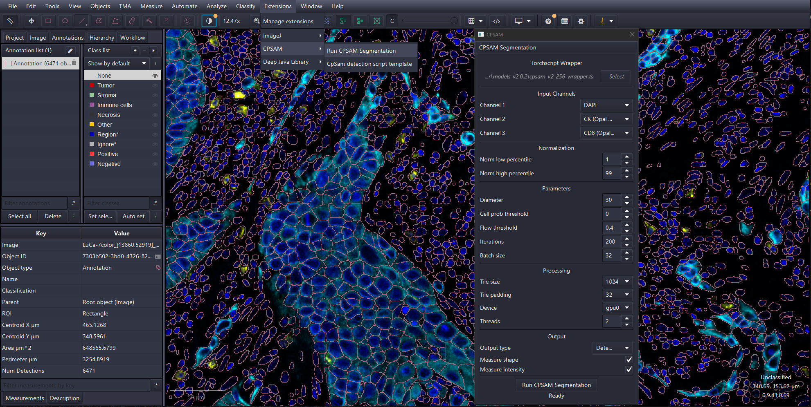

# CPSAM Extension for QuPath

A QuPath extension for running TorchScript-based Cellpose-SAM models (CPSAM and CPDINO) for cell segmentation in brightfiled and fluorescence images including whole slide images.

## Screenshot



## Torchscript Models

| Source Model Weights | Backbone | Devices | Torchscript variants | Data type
|-------|----------|---------|---------|---------
| **CPSAM** | SAM ViT-L | Device agnostic | cpsam_wrapper.ts | Float32
| **CPSAM_V2** | SAM ViT-L | Device agnostic | cpsam_v2_wrapper.ts | Float32
| **CPDINO (VIT-L)** | DINOv3 (vitl) | CUDA | coming soon... | Float32
|                    |               | CPU |  coming soon... | Float32
| **CPDINO (VIT-B)** | DINOv3 (vitb) | CUDA | coming soon... | Float32
|                    |               | CPU | coming soon... | Float32

> [!IMPORTANT]
> - Inference is only available for 2D data, no support for 3D datasets is available or planned.


## Prerequisites

- **QuPath 0.7.0+** (uses new ObjectMeasurements api from QuPath v0.8.0)
- **PyTorch engine** Setup Pytorch engine for DJL: _Extensions → Deep Java Library → Manage DJL Engines_
- **GPU acceleration**: CUDA and cuDNN are required (tested with CUDA 12.8 and cuDNN 9.10). Refer to qupath documentation [QuPath docs for gpu](https://qupath.readthedocs.io/en/stable/docs/deep/gpu.html) for more information.
- While not required it is highly recommended to use these models with GPU, vision transformer based models can be very slow on CPU.

## Installation

### Installation via QuPath's extension manager.
Install using using QuPath's extension manager.
   - Add CCResearch catalog to the QuPath's extension manager. CCResearch catalog URL:
   https://github.com/ajay1685/QuPath-CCResearch-Catalog
   - Scroll to QuPath-Extension-CPSAM entry under the CCResearch catalog in QuPath's extension manager
   - Click on the `+` green button next to the QuPath-Extension-CPSAM
   - Click on `Install`, the extension files will be downloaded and added to your QuPath extension directory

### Manual install

1. Build the extension:
   ```bash
   cd qupath-extension-cpsam
   gradlew build
   ```
2. Copy `build/libs/qupath-extension-cpsam-*.jar` to your QuPath extension directory, drag it on the QuPath UI.


## Usage
### QuPath
1. Open an image in QuPath (brightfield or fluorescence)
2. Create and/or select one or more _Annotation_ to process
3. Launch the extension: _Extensions → CPSAM → Run CPSAM_
4. Click download after selecting the model from dropdown menu.
5. Once the model download is complete, select gpu (if available) in the device dropdown.
6. Select Channels for segmentation, upto 3 channels are supported via the UI.
7. Defaults values are populated based on the Cellpose-SAM defaults. 
8. Click `Run Segmentation` to detect cells within selected annotation.

### CPSAM Parameters
Configure parameters in the dialog:
   - **Model**: Select a CPSAM varient (TorchScript wrapper) to download.
   - **Device**: Select cpu, cuda (for nvidia GPUs) or mps (Apple Silicon). MPS support pending...
   - **Diameter**: Expected cell diameter in pixel units
   - **Cell Probability**: Cell probability threshold between -5.0 and 5.0, defaults to 0.0 (refer to cellpose documentation for explaination).
   - **Flow Threshold**: Flow error threshold (defaults to 0.4), when set to 0 no cells are discarded. Increase flow error threshold to detect more cells (refer to cellpose documentation for explaination). Set to 0 to disable quality check (flow error) and return all possible detections.
   - **Tile size / padding**: Controls tiling for large (i.e. whole slide) images.
   - **Batch size**: Increase or descrese batch size based on available GPU VRAM. For example, on a gpu with 11GB VRAM you can comfortably use 32 bacth size and 2048 tilesize.
   - **Threads**: Number of parallel threads. Increase number of threads only when you have enough gpu vram available.

### Channel Selection

The extension supports selecting 1–3 input channels from:

- **Raw image channels**: Select channels by name
- **Color deconvolution channels**: Hematoxylin, Eosin, DAB, or other stains for brightfield images. Refer to QuPath's documentation for color deconvolution and seperating stains: https://qupath.readthedocs.io/en/stable/docs/tutorials/separating_stains.html#separating-stains 
- **(None)**: Channel 1 is required. Channels 2 and 3 are optional. When only one or two channels are selected, we zero-pads the other channels to force 3 channel input expected by the model.

### Post-Processing

Shape and intensity feature can be calculated on the fly:

- **Measurements**: Perform shape and intensity measurements on detected objects. New ObjectMeasurements api introduced in QuPath version 0.8.0 makes the intensity measurements faster.
- On the fly measurements will fallback to the measurement api in QuPath version 0.7.0 untill the version 0.8.0 is released.

> [!IMPORTANT]
> - On the fly measurements are faster with QuPath v0.8.0 or higher (when released).

## Parameters Reference

| Parameter | Default | Description |
|-----------|---------|-------------|
| Diameter | 30.0 px | Expected cell diameter; used for image scaling before inference |
| Cell prob threshold | 0.0 | Probability logit threshold (post-sigmoid = 0.5); lower = more detections, higher = less detections and tighter bounderies |
| Flow threshold | 0.4 | Flow integration threshold; lower = stricter quality filter, zero = return all cells |
| Tile size | 1024 | Non-overlapping tile step size in pixels |
| Tile padding | 64 | Extra context pixels per tile (model receives tile + 2×padding) |
| Batch size | 4 | Models's internal batch size for CPSAM and CPDINO backbone; larger = more VRAM required |
| Threads | 2 | Parallel threads for tile processing and measurements |
| Normalization percentile (low/high) | 1 and 99 | Per-channel global percentile normalization range |

Please refer to Cellpose documentation for additional information regarding normalization, cell probability threshold, flow error threshold, niter and channels. https://cellpose.readthedocs.io/en/latest/settings.html

## Troubleshooting

### Slow performance on CUDA
- Check if the GPU memory usage is exceeding VRAM, and shared memory is being consumed. Reduce **batch size**, **threads** first, you may also have to reduce the **tile size** if GPU VRAM is limited.
- Check VRAM usage: the extension logs `nvidia-smi` output when ```Verbose``` option is enabled in the preference pane.
- Try running on a small annotation, and/or CPU for debugging (slower but eliminates VRAM overflow issues)

### Model

- Ensure the `.ts` file is a valid TorchScript model (not a raw checkpoint). Instructions to export your own model trained with Cellpose-SAM as Torchscript model are coming soon...
- CPSAM torchscript wrapper is device agnostic (same model works for cpu or cuda) use cpsam_wrapper or cpsam_v2_wrapper.
- CPDINO models will be released soon...
- Verify PyTorch engine is installed: _Extensions → Deep Java Library → Manage DJL Engines_
- Verify that the PyTorch engine can use CUDA if applicable, refer to https://qupath.readthedocs.io/en/stable/docs/deep/gpu.html#checking-everything-works 

### No Detections

- Adjust **diameter** to match your cell size
- Lower **cell prob threshold** (e.g., -2.0) for more sensitive detection.
- set **Flow threshold** to zero (detect as many cells as possible) or higher value to return more cells.
- Check the selected input channels, and test your images with **cellpose v4.x** in a python environment. 

> [!TIP]
> Refer to Cellpose documentation to learn more about the segmentation parameters such as diameter, cell probability threshold, flow threshold and normalization method.

## Licensing Terms for the Torchscript Models available through the CPSAM extension

> [!CAUTION]
> Please consider doing your own research regarding applicable licenses, torchscript models provided and the extension code fall under different licensing terms. 

The TorchScript models loaded by this extension are derived from the [Cellpose v4.x](https://github.com/mouseland/cellpose-sam) pre-trained weights. Those models were trained on datasets with varying licensing terms. Users are responsible for ensuring their use complies with the original licenses and terms of the cellpose model weights (cpsam, cpsam_v2, cpdino, cpdino-vitb) from cellpose.

For license around the cellpose models (and derived work) please refer to Cellpose repository: [MouseLand/Cellpose](https://github.com/mouseland/cellpose)

> [!TIP]
> A discussion regarding this topic: https://forum.image.sc/t/question-about-cellpose-sam-pretrained-model-licensing-in-commercial-bioimage-software/121128

## GPL v3 License for QuPath-Extension-CPSAM (excluding torchscript models)

The extension code in this repository is licensed under the same terms as QuPath (GPL Version 3).

## Getting Help

For questions about using this extension, or to report issues please use the [image.sc forum](https://forum.image.sc/tag/qupath).


## Use citations where applicable

Pachitariu, M., Rariden, M., & Stringer, C. (2025). Cellpose-SAM: superhuman generalization for cellular segmentation. bioRxiv.

Stringer, C., Wang, T., Michaelos, M. et al Cellpose: a generalist algorithm for cellular segmentation. Nat Methods 18, 100–106 (2021). https://doi.org/10.1038/s41592-020-01018-x

Pachitariu, M. & Stringer, C. (2022). Cellpose 2.0: how to train your own model. Nature methods, 1-8.

Bankhead, P. et al. QuPath: Open source software for digital pathology image analysis. Scientific Reports (2017). https://doi.org/10.1038/s41598-017-17204-5

### More information regarding citation
- https://github.com/MouseLand/cellpose#citation
- https://qupath.readthedocs.io/en/stable/docs/intro/citing.html#how-to-cite-qupath

## Credits
This extension was inspired by several open-source projects from the bioimage analysis community at https://forum.image.sc/.

- Cellpose-SAM
- QuPath
- QuPath-Extension-Cellpose
- QuPath-Extension-StarDist
- QuPath-Extension-InstanSeg
- QuPath-Extension-DJL
- QuPath-Extension-WSIInfer
- QuPath-Extension-SpotiFlow

### Disclaimer
- Several large language models (both open and proprietary weights) were used in the development and implementation of various features of this extension, with human in the loop.

---

> [!NOTE]
> - Your feedback using CPSAM extension and groovy script in headless QuPath is welcome.

## Important Notes:
- This is not a full Cellpose-SAM implementation, nor is it endorsed by Dr. Pachitariu, Dr. Stringer, Dr. Rariden and their team at HHMI Janelia.  This extension offers easy to use method for segmenting cells in QuPath (based on cellpose-SAM pretrained models cpsam and cpdino variants).
- This is not a replacement for _BIOP/QuPath-Extension-Cellpose_ which offers more flexibility and features. Link: https://github.com/BIOP/qupath-extension-cellpose
- While the pre-processing steps for normalization and dynamics (post-processing) mimics cellpose implementation, it can not guarantee exact match with the cellpose output at pixel level. Model repository will include a python script to compare the results with cellpose original implementation. 

### Notes:
While limited this extension may offer a few advantages:
- CPSAM extension doesn't depend on python and it offers easy to use GUI within QuPath.
- The extension doen't save intermediate tiles or mask files which may help with faster inference while extending SSD/HDD life (compare to QuPath-Extension-Cellpose). 
- My internal testing indicates higher than 99% match with cellpose output. Instructions to compare the segmentation using the torchscript models with cellpose output are coming soon...
- Instruction to export your own model as torchscript model will be made available soon...
---


